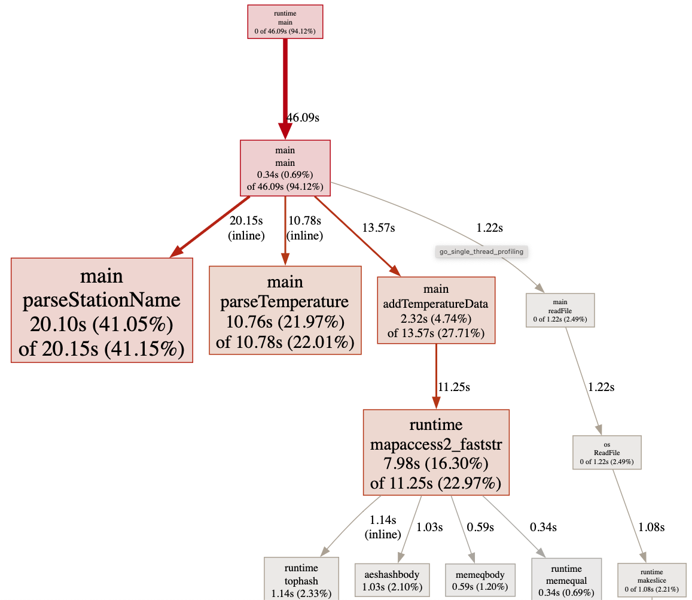

# 1 Billion Row Challenge

This is my take on the one billion row challenge: [gunnarmorling/1brc at Github](https://github.com/gunnarmorling/1brc?tab=readme-ov-file#rules-and-limits)

The results as a table: [Results](#results)

- [Relevant Rules and Properties of the Data](#relevant-rules-and-properties-of-the-data)
  - [The Task](#the-task)
  - [Properties We Can Use to Our Advantage](#properties-we-can-use-to-our-advantage)
- [How to Run](#how-to-run)
- [Other Solutions](#other-solutions)
  - [Using Go](#using-go)
- [Benchmarks](#benchmarks)
  - [Map of Records to Map of Indices into Arrays](#map-of-records-to-map-of-indices-into-arrays)
  - [Integer Sizes of the Temperature Arrays](#integer-sizes-of-the-temperature-arrays)
  - [Not Searching for the Newline Character, Not Parsing Twice](#not-searching-for-the-newline-character-not-parsing-twice)
  - [Not Searching for the Semicolon, Not Parsing the Station Name Twice](#not-searching-for-the-semicolon-not-parsing-the-station-name-twice)
  - [Profiling](#profiling)
    - [parseStationName](#parsestationname)
    - [parseTemperature](#parsetemperature)
    - [addTemperatureData](#addtemperaturedata)
  - [Change the Parsing of the Station Name and Temperature](#change-the-parsing-of-the-station-name-and-temperature)
  - [Is not Faster: Moving all Variable Declarations out of the Inner Loop](#is-not-faster-moving-all-variable-declarations-out-of-the-inner-loop)
  - [Interlude: Changing the Rounding of the Output](#interlude-changing-the-rounding-of-the-output)
  - [Parallelization - Preparation](#parallelization---preparation)
  - [Comparison](#comparison)
    - [wc](#wc)
    - [Java Reference Implementation](#java-reference-implementation)
    - [Naive (G)AWK](#naive-gawk)
  - [Go Solution by Shraddha Agrawal](#go-solution-by-shraddha-agrawal)
  - [Go Solution by Ben Hoyt](#go-solution-by-ben-hoyt)
  - [Go Solution by Alexander Yastrebov](#go-solution-by-alexander-yastrebov)
- [Results](#results)
- [Files](#files)
  - [Data and Java Reference Implementation](#data-and-java-reference-implementation)
- [License](#license)

## Relevant Rules and Properties of the Data

The non-Java specific rules and properties from [1BRC - Rules and limits](https://github.com/gunnarmorling/1brc?tab=readme-ov-file#rules-and-limits):

- No external library dependencies may be used
- The computation must happen at application runtime, i.e. you cannot process the measurements file at build time (for instance, when using GraalVM) and just bake the result into the binary
- Input value ranges are as follows:
  - Station name: non null UTF-8 string of min length 1 character and max length 100 bytes, containing neither `;` nor `\n` characters. (i.e. this could be 100 one-byte characters, or 50 two-byte characters, etc.)
  - Temperature value: non null double between -99.9 (inclusive) and 99.9 (inclusive), always with one fractional digit
- There is a maximum of 10,000 unique station names
- Line endings in the file are `\n` characters on all platforms
- Implementations must not rely on specifics of a given data set, e.g. any valid station name as per the constraints above and any data distribution (number of measurements per station) must be supported
- The rounding of output values must be done using the semantics of IEEE 754 rounding-direction "roundTowardPositive"

Interestingly these rules do not tell us what we have to do with all these values?! 😃

### The Task

Copied from [1BRC - Github](https://github.com/gunnarmorling/1brc)

> The task is to write a [Java] program which reads the file, calculates the min, mean, and max temperature value per weather station, and emits the results on stdout like this (i.e. sorted alphabetically by station name, and the result values per station in the format min/mean/max, rounded to one fractional digit)

Example solution:

```text
{Abha=-23.0/18.0/59.2, Abidjan=-16.2/26.0/67.3, Abéché=-10.0/29.4/69.0, ... }
```

Btw. `mean` here is the sum of all values divided by the number of values (the "arithmetic mean" of the values).

### Properties We Can Use to Our Advantage

- While 1 billion sounds like much, we can keep everything (the whole data file and the intermediate data) in 32GB RAM. So no need to think about memory. Which means that if you have less RAM, you should scale the number of rows accordingly (`500_000_000`, 500 millions if you've got 16GB, `250_000_000` if you've got 8GB, ...).
- A maximum of 10,000 unique station names: so we can set all capacities to 10,000 and won't need to reallocate when dynamically growing. This implies, that there is a maximum number of 100,000 (1,000,000,000 / 10,000) temperatures per station.
- All float values are in the inclusive interval `[-99.9, 99.9]` and have exactly (always!) one decimal digit. So if we parse these as integers, we get values in the interval `[-990, 990]`. Having a maximum of 100,000 temperature values implies that the sums of these integer values are (always) in `[-99 000 000, 99 000 000]`. This is a sub-interval of `[-2^27, 2^27] == [-134 217 728, 134 217 728]`, so 32 bit integers suffice to hold the sum of the temperature values.
- The max length of 100 bytes of the names => we can use a fixed 100 byte buffer to parse them into.

## How to Run

1. Generate the data file [./measurements.txt](./measurements.txt) by running the Python script [./create_measurements.py](./create_measurements.py) on the file [./weather_stations.csv](./weather_stations.csv):

   ```shell
   python3 ./create_measurements.py 1_000_000_000
   ```

   **Warning**: This script takes a long time to run and generates 15GB of data!
2. Generate the "official" output file for your data file by running the 1BRC's baseline Java implementation (you need Java 21 installed on your machine):

   ```shell
   java CalculateAverage_baseline.java > correct_results.txt
   ```

3. Compile and benchmark the single threaded Go version using [hyperfine](https://github.com/sharkdp/hyperfine):

    ```shell
    go build ./go_single_thread.go
    hyperfine -r 5 -w 1 './go_single_thread measurements.txt > solution.txt'
    ```

4. Compare the generated output file with the "official" output file:

   ```shell
   diff correct_results.txt ./solution.txt
   ```

5. Compile and benchmark the single threaded Go version using arrays:

    ```shell
    go build ./go_single_thread_arrays.go
    hyperfine -r 5 -w 1 './go_single_thread_arrays measurements.txt > solution.txt'
    ```

6. Compare the generated output file with the "official" output file:

   ```shell
   diff correct_results.txt ./solution.txt
   ```

7. Compile and benchmark the single threaded Go version not searching for the newline, so only parsing that part once:

    ```shell
    go build ./go_single_thread_arrays_single_parse.go
    hyperfine -r 5 -w 1 './go_single_thread_arrays_single_parse measurements.txt > solution.txt'
    ```

8. Compare the generated output file with the "official" output file:

   ```shell
   diff correct_results.txt ./solution.txt
   ```

9. Compile and benchmark the single threaded Go version not searching for the semicolon, so only parsing the station name once:

    ```shell
    go build ./go_single_thread_single_parse_II.go
    hyperfine -r 5 -w 1 './go_single_thread_single_parse_II measurements.txt > solution.txt'
    ```

10. Compare the generated output file with the "official" output file:

   ```shell
   diff correct_results.txt ./solution.txt
   ```

11. Compile and benchmark the single threaded Go version not searching for the semicolon, so only parsing the station name once:

    ```shell
    go build ./go_single_thread_parsing.go
    hyperfine -r 5 -w 1 './go_single_thread_parsing measurements.txt > solution.txt'
    ```

12. Compare the generated output file with the "official" output file:

   ```shell
   diff correct_results.txt ./solution.txt
   ```

13. Compile and benchmark the single threaded Go version which chopped the data into chunks:

    ```shell
    go build ./go_parallel_preparation.go
    hyperfine -r 5 -w 1 './go_parallel_preparation measurements.txt > solution.txt'
    ```

14. Compare the generated output file with the "official" output file:

   ```shell
   diff correct_results.txt ./solution.txt
   ```

## Other Solutions

Official Java implementations: [1BRC - Results](https://github.com/gunnarmorling/1brc?tab=readme-ov-file#results)

Other implementations mentioned on the 1BRC site: [1BRC on the Web](https://github.com/gunnarmorling/1brc?tab=readme-ov-file#1brc-on-the-web)

### Using Go

- [One Billion Rows Challenge in Golang - 19th February 2024](https://www.bytesizego.com/blog/one-billion-row-challenge-go)
- [The One Billion Row Challenge in Go: from 1m45s to 4s in nine solutions - March 2024](https://benhoyt.com/writings/go-1brc/)

## Benchmarks

All of this is running on my Apple M1 Max (Studio) with 32GB of RAM.

Detailed specs:

- 10-core CPU with 8 performance cores and 2 efficiency cores
- 24-core GPU
- 16-core Neural Engine
- 400GB/s memory bandwidth

Benchmark of [./go_single_thread.go](./go_single_thread.go): 98s, 1.6 minutes, 1 minute 38 seconds.

```shell
hyperfine -r 5 -w 1 './go_single_thread measurements_big.txt > solution_big.txt'
Benchmark 1: ./go_single_thread measurements_big.txt > solution_big.txt
  Time (mean ± σ):     98.484 s ±  1.296 s    [User: 90.378 s, System: 3.329 s]
  Range (min … max):   96.970 s … 100.237 s    5 runs
```

### Map of Records to Map of Indices into Arrays

Turing the naive hash map of records

```go
type stationTemperature struct {
  TempSum int32
  Count   uint32
  Min     int16
  Max     int16
}

stationData := make(map[string]stationTemperature, 10_000)
```

into a map of indices into arrays:

```go
type stationTemperatures struct {
  TempSum []int32
  Count   []uint32
  Min     []int16
  Max     []int16
}

stationIdxMap := make(map[string]int, 10_000)
stationData := stationTemperatures{
  TempSum: make([]int32, 10_000),
  Count:   make([]uint32, 10_000),
  Min:     make([]int16, 10_000),
  Max:     make([]int16, 10_000),
}
```

Benchmark of [./go_single_thread_arrays.go](./go_single_thread_arrays.go): 71s, 27s less than `./go_single_thread.go`.

```shell
hyperfine -r 5 -w 1 './go_single_thread_arrays measurements.txt > solution.txt'
Benchmark 1: ./go_single_thread_arrays measurements.txt > solution.txt
  Time (mean ± σ):     70.707 s ±  0.282 s    [User: 66.361 s, System: 1.657 s]
  Range (min … max):   70.288 s … 71.007 s    5 runs
```

### Integer Sizes of the Temperature Arrays

Changing the integer sizes of the arrays holding the temperature data from 16 bits to 32 bits makes the program run a bit slower.

So changing this:

```go
type stationTemperatures struct {
  TempSum []int32
  Count   []uint32
  Min     []int16
  Max     []int16
}
```

into this:

```go
type stationTemperatures struct {
  TempSum []int32
  Count   []uint32
  Min     []int32
  Max     []int32
}
```

make the program run 1s slower (72s instead of 71s).

But using "native" (in my case, 64 bit `int` and `uint`) gains 3s.

So changing this:

```go
type stationTemperatures struct {
  TempSum []int32
  Count   []uint32
  Min     []int16
  Max     []int16
}
```

into this:

```go
type stationTemperatures struct {
  TempSum []int
  Count   []uint
  Min     []int
  Max     []int
}
```

takes the time down from 71s to 68s.

```shell
hyperfine -r 5 -w 1 './go_single_thread_arrays_64bit_ints measurements.txt > solution.txt'
Benchmark 1: ./go_single_thread_arrays_64bit_ints measurements.txt > solution.txt
  Time (mean ± σ):     67.944 s ±  0.278 s    [User: 63.349 s, System: 2.022 s]
  Range (min … max):   67.603 s … 68.290 s    5 runs
```

### Not Searching for the Newline Character, Not Parsing Twice

Shaving another 3s off the run time, now at 65s, by not parsing the temperature data twice.

Turing this:

```go
newLineIdx := bytes.IndexByte(content[idx+semiColonIdx:], '\n')

for tmpIdx := idx + semiColonIdx + 1; tmpIdx < idx+semiColonIdx+newLineIdx; {
  currByte := content[tmpIdx]
  if currByte == '-' {
    negate = -1
  } else if currByte != '.' {
    intVal := currByte - '0'
    temperature = temperature*10 + int(intVal)
  }
  tmpIdx++
}
```

into this:

```go
tmpIdx := idx + semiColonIdx + 1
newLineIdx := 0
Loop:
for tmpIdx < len(content) {
 currByte := content[tmpIdx]
 tmpIdx++
 newLineIdx++
 switch currByte {
 case '-':
   negate = -1
 case '\n':
   break Loop
 case '.':
   continue
 default:
   intVal := currByte - '0'
   temperature = temperature*10 + int(intVal)
 }
}
```

Btw. using `else if`s instead of the `switch` is minimally slower (500ms).

```shell
hyperfine -r 5 -w 1 './go_single_thread_arrays_single_parse measurements.txt > solution.txt'
Benchmark 1: ./go_single_thread_arrays_single_parse measurements.txt > solution.txt
  Time (mean ± σ):     64.953 s ±  0.535 s    [User: 60.135 s, System: 2.173 s]
  Range (min … max):   64.441 s … 65.843 s    5 runs
```

### Not Searching for the Semicolon, Not Parsing the Station Name Twice

Another 9s off by not parsing the station name twice, by not searching for the semicolon first. Now we are at 56s.

Changing:

```go
semiColonIdx := bytes.IndexByte(content[idx:], ';')
// End of file.
if semiColonIdx < 0 {
  break
}
station := content[idx : idx+semiColonIdx]
```

to:

```go
semiColonIdx := 0
station := [100]byte{}
currByte := content[idx]
for currByte != ';' {
  station[semiColonIdx] = currByte
  semiColonIdx++
  currByte = content[idx+semiColonIdx]
}
// and using `station[:semiColonIdx]` instead of `station`.
```

```shell
hyperfine -r 5 -w 1 './go_single_thread_single_parse_II measurements.txt > solution.txt'
Benchmark 1: ./go_single_thread_single_parse_II measurements.txt > solution.txt
  Time (mean ± σ):     55.935 s ±  0.415 s    [User: 50.707 s, System: 2.420 s]
  Range (min … max):   55.255 s … 56.388 s    5 runs
```

### Profiling

Now is the time to profile the program to see, where the most time is spent.

So we refactor everything out of the main loop, so that we got function names in the profile. And add the profiling stanza to write the data to the file `cpu.prof`.

```go
f, err := os.Create("cpu.prof")
if err != nil {
  log.Fatal(err)
}
pprof.StartCPUProfile(f)
defer pprof.StopCPUProfile()
```

See file [./go_single_thread_profiling.go](./go_single_thread_profiling.go).

Compiling and running this executable generates the profile file `cpu.prof`:

```shell
go build ./go_single_thread_profiling.go
./go_single_thread_profiling measurements.txt > solution.txt
go tool pprof ./go_single_thread_profiling cpu.prof
```

and then, in the `pprof` prompt, type:

```text
(pprof) web
```

Opens the following image in the browser:


Or you can start a pprof web-server at localhost with port 8080 by using

```shell
go build ./go_single_thread_profiling.go
./go_single_thread_profiling measurements.txt > solution.txt
go tool pprof -http=localhost:8080 ./go_single_thread_profiling cpu.prof
```

| Function           | Time Spent |
| ------------------ | ---------- |
| parseStationName   | 20.10s     |
| mapaccess2_faststr | 11.25s     |
| parseTemperature   | 10.76s     |
| addTemperatureData | 2.32s      |
| readFile           | 1.22s      |

So loading the data from file into a byte array takes 1.22 seconds, and the time to sort and print the results isn't even on this image.

The most time is spent parsing the station name, then hash table lookups and writes and the third is the parsing of the temperatures.

So, let's look at the details of each of these functions.

#### parseStationName

```text
list parseStationName
Total: 48.97s
ROUTINE ======================== main.parseStationName in /Users/roland/Documents/code/1-billion-row-challenge/go_single_thread_profiling.go
    20.10s     20.15s (flat, cum) 41.15% of Total
         .          .     36:func parseStationName(content []byte, idx int) (int, []byte) {
         .          .     37:   semiColonIdx := 0
      60ms      100ms     38:   station := [100]byte{}
     1.54s      1.54s     39:   currByte := content[idx]
     140ms      140ms     40:   for currByte != ';' {
     850ms      850ms     41:           station[semiColonIdx] = currByte
         .          .     42:           semiColonIdx++
    15.71s     15.72s     43:           currByte = content[idx+semiColonIdx]
         .          .     44:   }
     1.80s      1.80s     45:   return semiColonIdx, station[:semiColonIdx]
         .          .     46:}
         .          .     47:
         .          .     48:func parseTemperature(idx int, semiColonIdx int, content []byte) (int, int) {
         .          .     49:   var temperature int = 0
         .          .     50:   var negate int = 1
```

#### parseTemperature

```text
(pprof) list parseTemperature
Total: 48.97s
ROUTINE ======================== main.parseTemperature in /Users/roland/Documents/code/1-billion-row-challenge/go_single_thread_profiling.go
    10.76s     10.78s (flat, cum) 22.01% of Total
         .          .     48:func parseTemperature(idx int, semiColonIdx int, content []byte) (int, int) {
         .          .     49:   var temperature int = 0
         .          .     50:   var negate int = 1
         .          .     51:   tmpIdx := idx + semiColonIdx + 1
         .          .     52:   newLineIdx := 0
         .          .     53:Loop:
      40ms       40ms     54:   for tmpIdx < len(content) {
     8.57s      8.57s     55:           currByte := content[tmpIdx]
     400ms      400ms     56:           tmpIdx++
      10ms       10ms     57:           newLineIdx++
         .          .     58:           switch currByte {
     1.32s      1.33s     59:           case '-':
         .          .     60:                   negate = -1
         .          .     61:           case '\n':
         .          .     62:                   break Loop
     420ms      430ms     63:           case '.':
         .          .     64:                   continue
         .          .     65:           default:
         .          .     66:                   intVal := currByte - '0'
         .          .     67:                   temperature = temperature*10 + int(intVal)
         .          .     68:           }
```

#### addTemperatureData

```text
(pprof) list addTemperatureData
Total: 48.97s
ROUTINE ======================== main.addTemperatureData in /Users/roland/Documents/code/1-billion-row-challenge/go_single_thread_profiling.go
     2.32s     13.57s (flat, cum) 27.71% of Total
     290ms      290ms     74:func addTemperatureData(stationIdxMap *map[string]int, station []byte, stationData *stationTemperatures, temperature int, stationIdx int) int {
     140ms     11.39s     75:   stIdx, ok := (*stationIdxMap)[string(station)]
     210ms      210ms     76:   if ok {
        1s         1s     77:           stationData.TempSum[stIdx] += temperature
     270ms      270ms     78:           stationData.Count[stIdx]++
     170ms      170ms     79:           stationData.Min[stIdx] = min(stationData.Min[stIdx], temperature)
     130ms      130ms     80:           stationData.Max[stIdx] = max(stationData.Max[stIdx], temperature)
         .          .     81:   } else {
         .          .     82:           (*stationIdxMap)[string(station)] = stationIdx
         .          .     83:           stationData.TempSum[stationIdx] += temperature
         .          .     84:           stationData.Count[stationIdx]++
         .          .     85:           stationData.Min[stationIdx] = temperature
         .          .     86:           stationData.Max[stationIdx] = temperature
         .          .     87:           stationIdx++
         .          .     88:   }
         .          .     89:
     110ms      110ms     90:   return stationIdx
         .          .     91:}
```

### Change the Parsing of the Station Name and Temperature

Another 4s less - now at 52s - by changing the parsing from:

```go
for idx < len(content) {
  semiColonIdx := 0
  station := [100]byte{}
  currByte := content[idx]
  for currByte != ';' {
    station[semiColonIdx] = currByte
    semiColonIdx++
    currByte = content[idx+semiColonIdx]
  }
  var temperature int = 0
  var negate int = 1
  tmpIdx := idx + semiColonIdx + 1
  newLineIdx := 0
 Loop:
  for tmpIdx < len(content) {
    currByte = content[tmpIdx]
    tmpIdx++
    newLineIdx++
    switch currByte {
    case '-':
      negate = -1
    case '\n':
      break Loop
    case '.':
      continue
    default:
      intVal := currByte - '0'
      temperature = temperature*10 + int(intVal)
   }
  }
  temperature *= negate
    ...
  idx += semiColonIdx + newLineIdx + 1
}
```

to

```go
for len(content) > 0 {
  station := [100]byte{}
  // Station name is not empty.
  semiColonIdx := 1
  station[0] = content[0]
  currByte := content[1]
  for currByte != ';' {
   station[semiColonIdx] = currByte
   semiColonIdx++
   currByte = content[semiColonIdx]
  }
  var temperature int = 0
  var negate = false
  if content[semiColonIdx+1] == '-' {
    negate = true
    content = content[semiColonIdx+2:]
  } else {
    content = content[semiColonIdx+1:]
  }
  // Either `N.N\n` or `NN.N\n`
  if content[1] == '.' {
    temperature = int(content[0])*10 + int(content[2]) - '0'*11
    content = content[4:]
  } else {
    temperature = int(content[0])*100 + int(content[1])*10 + int(content[3]) - '0'*111
    content = content[5:]
  }
  if negate {
    temperature *= -1
  }
    ...
}
```

```shell
hyperfine -r 5 -w 1 './go_single_thread_parsing measurements.txt > solution.txt'
Benchmark 1: ./go_single_thread_parsing measurements.txt > solution.txt
  Time (mean ± σ):     51.951 s ±  0.223 s    [User: 47.165 s, System: 1.911 s]
  Range (min … max):   51.702 s … 52.176 s    5 runs
```

### Is not Faster: Moving all Variable Declarations out of the Inner Loop

**This is not faster than the previous solution**. Ii left this in here to show, that even if a benchmark tells us that a version is faster (by 1s, or 2%) we should **always** recheck such (relatively) small differences. Rerunning the benchmark 2 times shows, that this is actually slower than the previous version. Yes, other programs (or whatever) running on the same machine _do_ alter benchmark results, even by making them seemingly faster.

By moving all variable declarations out of the inner loop, we can reduce the run time by another second, so it is now 51s.

From

```go
for len(content) > 0 {
  station := [100]byte{}
  semiColonIdx := 1
  currByte := content[1]
    ...
  var temperature int = 0
  var negate = false
  ...
  stIdx, ok := stationIdxMap[string(station[:semiColonIdx])]
  ...
}
```

to

```go
station := [100]byte{}
semiColonIdx := 1
var temperature int = 0
var negate = false
var currByte byte = 0
var ok bool = false
var stIdx int = 0
// We suppose the file is valid, without a single error.
// Not a single error check is made.
for len(content) > 0 {
   semiColonIdx = 1
   ...
}
```

```shell
hyperfine -r 5 -w 1 './go_single_thread_variables measurements.txt > solution.txt'
Benchmark 1: ./go_single_thread_variables measurements.txt > solution.txt
  Time (mean ± σ):     50.659 s ±  0.071 s    [User: 46.738 s, System: 1.597 s]
  Range (min … max):   50.566 s … 50.762 s    5 runs
```

### Interlude: Changing the Rounding of the Output

So far the output isn't really rounded in the way the Java program does it, it has just been "faked" by hardcoding the output of `0.0` whenver a negative zero (`-0.0`) would have been printed. I've not invested much time and just used the solution used by Alexander Yastrebov in his solution [Function roundJava](https://github.com/gunnarmorling/1brc/blob/main/src/main/go/AlexanderYastrebov/calc.go#L242)

I use this version, keep in mind that all values are multiplied by 10 and need to be divided by 10 to get the "real" value:

```go
func roundJava(x float64) float64 {
  rounded := math.Trunc(x)
  if x < 0.0 && rounded-x == 0.5 {
    return rounded / 10.0
  } else if math.Abs(x-t) >= 0.5 {
    rounded += math.Copysign(1, x)
  }

  // oh, another hardcoded `-0.0` to `0.0` conversion.
  if rounded == 0 {
    return 0.0
  }

  return rounded / 10.0
}
```

### Parallelization - Preparation

If you may have wondered, if reading the whole file at once really is the fastest solution, then here is the answer: no, it isn't. We can do better.

I just wanted to change the file reading at the first step of the parallelization. In this version we read and process the file in "number of Cores" chunks and sum the results together. This - without any parallelization - is 3s faster than the `go_single_thread_parsing.go` solution, so the last single threaded version takes 49s - we have exactly halved the time of the first version.

The chunk calculation happens here:

```go
fsInfo, err := file.Stat()
size := fsInfo.Size()
chunkSize := size / int64(numCPUs)

chunkList := make([]chunk, 0, numCPUs)
chunkList = append(chunkList, chunk{
  StartIdx: 0,
  EndIdx:   size - 1,
})

var readOff int64 = chunkSize
buffer := make([]byte, 150)
for cpuIdx := 1; cpuIdx < numCPUs; cpuIdx++ {
  _, err = file.ReadAt(buffer, readOff)
  if err != nil {
    fmt.Fprintf(os.Stderr, "Error reading file '%s' for chunking:\n%s\n", fileName, err)
    os.Exit(4)
  }
  newlineIdx := bytes.IndexByte(buffer, '\n')
  if newlineIdx < 0 {
    chunkList[cpuIdx-1].EndIdx = size - 1
    break
  }
  chunkList = append(chunkList, chunk{
    StartIdx: readOff + int64(newlineIdx) + 1,
    EndIdx:   size - 1,
  })
  chunkList[cpuIdx-1].EndIdx = readOff + int64(newlineIdx)
  readOff += chunkSize
}
```

```shell
hyperfine -r 5 -w 1 './go_parallel_preparation measurements.txt > solution.txt'
Benchmark 1: ./go_parallel_preparation measurements.txt > solution.txt
  Time (mean ± σ):     49.293 s ±  0.066 s    [User: 47.507 s, System: 0.813 s]
  Range (min … max):   49.230 s … 49.396 s    5 runs
```

### Comparison

#### wc

First the time it takes `wc` to just count the lines of the data file to check if it really are 1 billion rows:

```shell
% time wc -l measurements.txt
 1000000000 measurements.txt
wc -l measurements.txt  14.95s user 1.20s system 95% cpu 16.857 total
```

So there really are 1 billion rows in this file! It took about 17s just to count the lines (`\n` characters).

#### Java Reference Implementation

The official Java solution needs about 220s, 3.7 minutes (no, I did not care to run it more than once, like using `hyperfine`):

```shell
export PATH="/opt/homebrew/opt/openjdk/bin:$PATH"; time java CalculateAverage_baseline.java > correct_results.txt
java CalculateAverage_baseline.java > correct_results.txt  215.46s user 4.90s system 100% cpu 3:39.22 total
```

#### Naive (G)AWK

The naive AWK script [./awk.awk](./awk.awk) takes about 600s, 10 minutes (no, I did not care to run it more than once, like using `hyperfine`):

```awk
# $1, the first field, is the location's name.
# $2, the second field, is the temperature in Celsius.
# The field separator `FS` is `;`.

BEGIN {
    FS = ";"
}

{
    if (!count[$1]) {
        count[$1] = 1
        min[$1] = $2
        max[$1] = $2
        sum[$1] = $2
    } else {
        count[$1]++
        if ($2 < min[$1]) {
            min[$1] = $2
        } else if ($2 > max[$1]) {
            max[$1] = $2
        }
        sum[$1] += $2
    }
}

END {
    printf "{"
    num = asorti(count, stations_sorted)
    for (i = 1; i <= num; i++) {
        station = stations_sorted[i]
        printf "%s=%.1f/%.1f/%.1f", station, min[station], sum[station] / count[station], max[station]
        if (i < num) {
            printf ", "
        }
    }
    printf "}\n"
}

```

This GAWK script does **not** round the average values like the official Java solution, but everything else is the same.

```shell
time gawk -f awk.awk measurements.txt > solution.txt
gawk -f awk.awk measurements_big.txt > solution_big.txt  595.04s user 3.70s system 99% cpu 10:00.36 total
```

### Go Solution by Shraddha Agrawal

The Go solution from the blog post [One Billion Rows Challenge in Golang](https://www.bytesizego.com/blog/one-billion-row-challenge-go). I had to add code to get output on Stdout, this program did not print the results. This takes about 12s.

```shell
hyperfine -r 5 -w 1 './go_Shraddha_Agrawal -input measurements.txt > solution.txt'
Benchmark 1: ./go_Shraddha_Agrawal -input measurements.txt > solution.txt
  Time (mean ± σ):     12.141 s ±  0.318 s    [User: 98.765 s, System: 1.857 s]
  Range (min … max):   11.736 s … 12.539 s    5 runs
```

### Go Solution by Ben Hoyt

This is the fasted version (R9) from the Blog post [The One Billion Row Challenge in Go: from 1m45s to 4s in nine solutions](https://benhoyt.com/writings/go-1brc/). **This version does not produce the correct mean values, it generates `-0.0` instead of `0.0` as the average for some stations**.

I needed to change the source to be able to have a comparable version for the benchmark. It did use 12 Threads, but took 75s (1:15 minutes), so maybe I did make some error when adding the main function to call it.

```shell
hyperfine -r 5 -w 1 './go_Ben_Hoyt measurements.txt > solution.txt'
Benchmark 1: ./go_Ben_Hoyt measurements.txt > solution.txt
  Time (mean ± σ):     74.583 s ±  1.005 s    [User: 696.073 s, System: 2.520 s]
  Range (min … max):   73.364 s … 76.123 s    5 runs
```

### Go Solution by Alexander Yastrebov

This program needs about 4s. The source can be found [1BRC - Go](https://github.com/gunnarmorling/1brc/blob/main/src/main/go/AlexanderYastrebov/calc.go).

```shell
hyperfine -r 5 -w 1 './go_Alexander_Yastrebov measurements.txt > solution.txt'
Benchmark 1: ./go_Alexander_Yastrebov measurements.txt > solution.txt
  Time (mean ± σ):      4.027 s ±  0.020 s    [User: 35.769 s, System: 1.355 s]
  Range (min … max):    4.003 s …  4.049 s    5 runs
```

## Results

For details see [Benchmarks](#benchmarks)

- `wc -l`: the time `wc -l measurements.txt` takes. Just the number of lines.
- [./awk.awk](./awk.awk): the time `gawk -f awk.awk measurements.txt > solution.txt` takes. A naive, single threaded GAWK implementation, does not produce correctly rounded output.
- [Java Reference Implementation](./CalculateAverage_baseline.java): the time `java CalculateAverage_baseline.java > correct_results.txt` takes. 1BRC's reference implementation (naive implementation).
- `Go Alexander Yastrebov`: fastest Go version of [1BRC - Go](https://github.com/gunnarmorling/1brc/blob/main/src/main/go/AlexanderYastrebov/calc.go)
- `Go Shraddha Agrawal`: fasted Version of [One Billion Rows Challenge in Golang](https://www.bytesizego.com/blog/one-billion-row-challenge-go)
- `Go Ben Hoyt`: does not produce the correct output, fastest version of [The One Billion Row Challenge in Go: from 1m45s to 4s in nine solutions](https://benhoyt.com/writings/go-1brc/).
- [./go_single_thread.go](./go_single_thread.go): my baseline Go version, single threaded and using a map of structures.
- [./go_single_thread_arrays.go](./go_single_thread_arrays.go): my baseline Go version, single threaded and using an array of structures.
- [./go_single_thread_arrays_64bit_ints.go](./go_single_thread_arrays_64bit_ints.go) the same as above, but using 64 bit integers to hold all temperature data (minimum and maximum values too).
- [./go_single_thread_arrays_single_parse.go](./go_single_thread_arrays_single_parse.go): the same as above, but do not search for the new line (`\n`) before parsing the temperature value.
- [./go_single_thread_single_parse_II.go](./go_single_thread_single_parse_II.go): same as above, but not searching for the semicolon and instead only parsing the station name once.
- [./go_single_thread_parsing.go](./go_single_thread_parsing.go): same as above, changed the parsing of the station name and temperature value.
- [./go_parallel_preparation.go](./go_parallel_preparation.go): same as above, the file is read and processed in "number of cores" chunks and summed together.

| Program                                 | Time |
| --------------------------------------- | ---- |
| wc -l                                   | 17s  |
| awk.awk                                 | 600s |
| Java Reference Implementation           | 220s |
| Go Alexander Yastrebov                  | 4s   |
| Go Shraddha Agrawal                     | 12s  |
| Go Ben Hoyt*                            | 75s  |
| go_single_thread.go                     | 98s  |
| go_single_thread_arrays.go              | 71s  |
| go_single_thread_arrays_64bit_ints.go   | 68s  |
| go_single_thread_arrays_single_parse.go | 65s  |
| go_single_thread_single_parse_II.go     | 56s  |
| go_single_thread_parsing.go             | 52s  |
| go_parallel_preparation.go              | 49s  |

## Files

This is a description of the files in this repository and the generated files, which are not checked in to Git.

- [./awk.awk](./awk.awk): straightforward GNU AWK implementation, to get a baseline time. Needs GNU awk, `gawk` to run, POSIX `awk` is not supported because of the sorting function it uses.
- [./go_single_thread.go](./go_single_thread.go): the baseline go version, single threaded and using a map of structures.
- [./go_single_thread_arrays.go](./go_single_thread_arrays.go): first iteration, changing the map of structures to a map of indices into an structure of arrays.
- [./go_single_thread_arrays_64bit_ints.go](./go_single_thread_arrays_64bit_ints.go): the same as above, but using `int` or `uint` - 64 bit integers - for all arrays holding temperature data, instead of the minimal needed 16 or 32 bit integers.
- [./go_single_thread_arrays_single_parse.go](./go_single_thread_arrays_single_parse.go): the same as above, but do not search for the new line (`\n`) before parsing the temperature value.
- [./go_single_thread_single_parse_II.go](./go_single_thread_single_parse_II.go): same as above, but not searching for the semicolon and instead only parsing the station name once.
- [./go_single_thread_parsing.go](./go_single_thread_parsing.go): same as above, changed the parsing of the station name and temperature value.
- [./go_parallel_preparation.go](./go_parallel_preparation.go): same as above, the file is read and processed in "number of cores" chunks and summed together.

### Data and Java Reference Implementation

- [measurements.txt](./measurements.txt): the data file generated by the Python script [./create_measurements.py](./create_measurements.py). Not checked in to Git. To generate, see the [How to Run](#how-to-run) section above.
- [./correct_results.txt](./correct_results.txt): the "official" output file generated by the baseline Java implementation [./CalculateAverage_baseline.java](./CalculateAverage_baseline.java), the reference solution to compare all others against. Not checked in to Git. To generate, see the [How to Run](#how-to-run) section above.
- [./weather_stations.csv](./weather_stations.csv): the CSV file used as input for the Python script [./create_measurements.py](./create_measurements.py).
- [./create_measurements.py](./create_measurements.py): the Python script used to generate the data file [./measurements.txt](./measurements.txt).
- [./CalculateAverage_baseline.java](./CalculateAverage_baseline.java): the baseline Java implementation used to generate the "official" output file [./correct_results.txt](./correct_results.txt).

## License

The code in this repository is licensed under the MIT license, see file [./LICENSE](./LICENSE).
Except the Python script [./create_measurements.py](./create_measurements.py) to generate the data, and the base Java implementation [./CalculateAverage_baseline.java](./CalculateAverage_baseline.java) which are licensed under the Apache 2.0 license.
